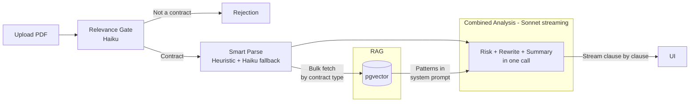

# RedFlag AI

AI-powered contract red-flag detector. Upload a PDF, DOCX, or TXT file and get clause-by-clause risk analysis with streaming results.

[](https://github.com/luclacombe/red-flag-ai/actions/workflows/ci.yml)

**Live:** [red-flag-ai.com](https://red-flag-ai.com)

---

## How It Works

1. Upload a contract (PDF)
2. AI checks if it's actually a contract and rejects non-contracts immediately
3. Clauses are extracted and analyzed against a curated knowledge base of predatory patterns (RAG)
4. Results stream to the UI in real-time, with each clause scored red/yellow/green and explained
5. Get a summary with an overall risk score, top concerns, and a sign/don't-sign recommendation

## Architecture



### Pipeline

| Step | Agent | Model | Purpose |
|------|-------|-------|---------|
| 1 | Relevance Gate | Haiku | Is this a contract? What type? What language? |
| 2 | Smart Parse | Heuristic (+ Haiku fallback) | Split document into individual clauses |
| 3 | Combined Analysis | Sonnet (streaming) | Score each clause, generate safer alternatives, produce summary. Single API call with `report_clause` + `report_summary` tools. |

Total API calls: 3-4 (gate + optional Haiku boundary detection + combined analysis + optional summary fallback).

## Tech Stack

| Layer | Technology |
|-------|-----------|
| Frontend | Next.js 16, React 19, TypeScript strict, Tailwind CSS v4, shadcn/ui |
| API | tRPC v11 (end-to-end type safety, SSE subscriptions) |
| AI | Claude API (Anthropic SDK), multi-agent pipeline |
| Embeddings | Voyage AI (voyage-law-2, 1024 dims) |
| Database | Supabase (PostgreSQL + pgvector + Storage) |
| ORM | Drizzle |
| Validation | Zod v4 at all boundaries |
| Deployment | Vercel (Node.js runtime, 300s timeout) |
| CI/CD | GitHub Actions (lint → type-check → test → build) |
| Linting | Biome |

## Project Structure

```
apps/web/              → Next.js App Router (UI + route handlers)
packages/api/          → tRPC v11 routers, procedures, context
packages/agents/       → Agent pipeline (gate, smart parse, combined analysis, summary fallback)
packages/db/           → Drizzle schema, migrations, vector search, embeddings
packages/shared/       → Zod schemas, types, constants, logger
```

Dependency direction: `web → api → agents → db → shared` (shared is the leaf).

## Local Setup

### Prerequisites

- [Node.js](https://nodejs.org/) 22+
- [pnpm](https://pnpm.io/) 10+
- [Docker Desktop](https://www.docker.com/products/docker-desktop/) (for local Supabase)
- [Supabase CLI](https://supabase.com/docs/guides/cli/getting-started) 2.x
- An [Anthropic API key](https://console.anthropic.com/)

### Quick Start

```bash
# 1. Clone and install
git clone https://github.com/luclacombe/red-flag-ai.git
cd red-flag-ai
pnpm install

# 2. Start local Supabase (Postgres + pgvector, Auth, Storage, Studio)
pnpm supabase:start

# 3. Reset database (applies migrations + seeds knowledge base with pre-computed embeddings)
pnpm supabase:reset

# 4. Configure environment
cp .env.example .env.local
# Edit .env.local — add your ANTHROPIC_API_KEY

# 5. Start dev server
pnpm dev
```

Open [http://localhost:3000](http://localhost:3000). Supabase Studio is at [http://127.0.0.1:54323](http://127.0.0.1:54323).

### Environment Variables

| Variable | Required | Description |
|----------|----------|-------------|
| `NEXT_PUBLIC_SUPABASE_URL` | Yes | Supabase API URL (`http://127.0.0.1:54321` locally) |
| `NEXT_PUBLIC_SUPABASE_ANON_KEY` | Yes | Supabase anon key (well-known local dev key in `.env.example`) |
| `SUPABASE_SERVICE_ROLE_KEY` | Yes | Supabase service role key (well-known local dev key in `.env.example`) |
| `DATABASE_URL` | Yes | Postgres connection string |
| `NEXT_PUBLIC_APP_URL` | Yes | App URL (`http://localhost:3000` locally) |
| `MASTER_ENCRYPTION_KEY` | Yes | 32-byte hex key for AES-256-GCM at-rest encryption (dev key in `.env.example`) |
| `CRON_SECRET` | Yes | Bearer token for cron endpoint |
| `ANTHROPIC_API_KEY` | Yes | Claude API key for contract analysis |
| `VOYAGE_API_KEY` | No | Voyage AI API key (only needed if re-seeding knowledge base via `pnpm run seed`) |

### Available Commands

| Command | Description |
|---------|-------------|
| `pnpm dev` | Start Next.js dev server |
| `pnpm build` | Build all packages + Next.js app |
| `pnpm turbo lint` | Biome lint across all packages |
| `pnpm turbo type-check` | TypeScript strict check across all packages |
| `pnpm turbo test` | Vitest across all packages |
| `pnpm turbo lint type-check test build` | Full quality gate |
| `pnpm supabase:start` | Start local Supabase |
| `pnpm supabase:stop` | Stop local Supabase |
| `pnpm supabase:reset` | Reset DB (re-apply migrations + seed) |
| `pnpm run seed` | Seed knowledge base via Voyage AI (needs `VOYAGE_API_KEY`) |

## What I'd Improve With More Time

- **Jurisdiction-specific patterns.** The knowledge base is jurisdiction-agnostic. Add region-specific pattern sets (EU, US states, UK).
- **LLM observability.** Add tracing (e.g., Langfuse) for token usage, latency per agent, and prompt versioning.
- **Contract comparison.** Upload two versions of a contract, diff the clauses.
- **PDF viewer.** Render the original PDF in the side-by-side view instead of extracted text.

## Cost Note

Each full analysis costs approximately **$0.10 to $0.20** in API calls (Claude + Voyage AI), depending on document length. Rate limiting controls spend: 2 analyses/day for anonymous users, 10/day for authenticated users.

## Legal Disclaimer

RedFlag AI is **not a substitute for professional legal advice**. It provides AI-generated analysis for informational purposes only. Always consult a qualified attorney before making legal decisions based on contract review. The developers are not responsible for any actions taken based on this tool's output.
