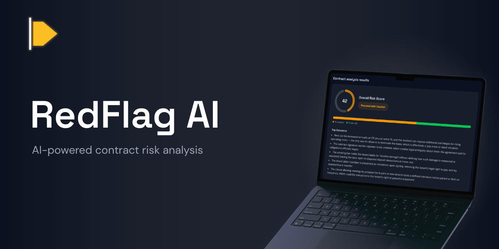
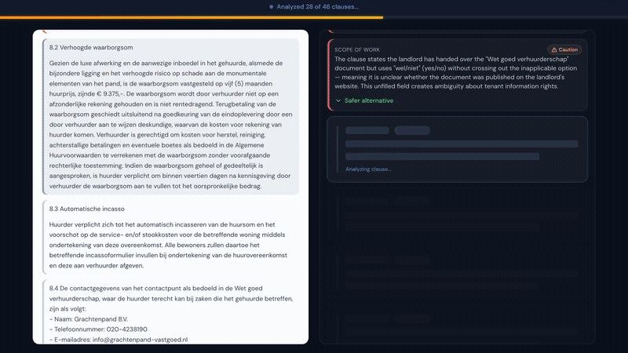
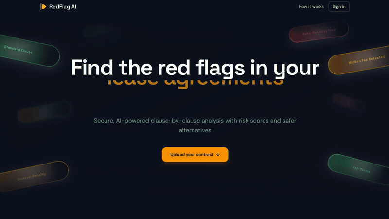
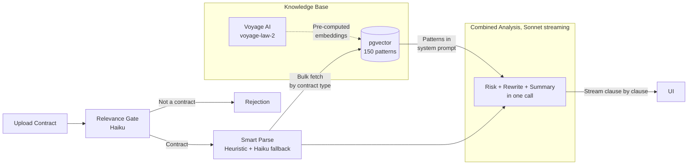

<p align="center">
  
</p>

<p align="center">
  <a href="https://github.com/luclacombe/red-flag-ai/actions/workflows/ci.yml"></a>
  
  
  <a href="https://red-flag-ai.com"></a>
  
</p>

<p align="center">
  <b><a href="https://red-flag-ai.com">Live Demo</a></b> &middot;
  <a href="#features">Features</a> &middot;
  <a href="#architecture">Architecture</a> &middot;
  <a href="#engineering-highlights">Engineering</a> &middot;
  <a href="#local-setup">Setup</a>
</p>

---

> Upload a contract. Get clause-by-clause risk analysis with streaming results.

<h3 align="center">Streaming analysis</h3>

<p align="center">
  
</p>

## Features

- **Multi-format upload** with PDF magic-byte validation, DOCX, and plain text
- **AI relevance gate** that rejects non-contracts before wasting compute
- **RAG-grounded analysis** using 150 curated predatory patterns, Voyage AI legal embeddings, and pgvector
- **Persistent streaming** where the pipeline runs detached from the client. Navigate away mid-analysis, check live progress on the dashboard, click back in and pick up right where you left off.
- **Side-by-side view** with interactive clause highlighting, hover/pin interactions, and SVG connecting lines between the document and analysis cards
- **15-language support** for analysis in the user's chosen language, while safer alternatives stay in the document's original language
- **Full auth system** with email/password, magic links, and OAuth (Google, Microsoft, GitHub)
- **Dashboard** with rename, rerun, rerun in a different language, share/unshare, download PDF report, renew, and delete
- **Shareable reports** via 7-day expiring links and downloadable branded PDF exports
- **Privacy-first** with AES-256-GCM encryption at rest, 30-day auto-deletion, and GDPR-compliant IP hashing

<h3 align="center">Landing page</h3>

<p align="center">
  
</p>

## Architecture



Three specialized agents, each a pure async function with Zod-validated inputs and outputs. Total: 3-4 Claude API calls per analysis.

| Step | Model | What it does |
|------|-------|-------------|
| Relevance Gate | Haiku | Rejects non-contracts. Detects contract type and language. |
| Smart Parse | Heuristic + Haiku fallback | Splits the document into clauses. Regex runs first (free, instant). Falls back to LLM boundary detection when results look suspicious. |
| Combined Analysis | Sonnet (streaming) | Scores each clause, generates safer alternatives, and produces a summary in a single streaming call. |

150 predatory contract patterns embedded with Voyage AI's `voyage-law-2` model (legal-domain, 1024 dims) and stored in pgvector. Bulk-fetched by contract type and injected into the system prompt so Claude knows what to flag. Seed data ships with pre-computed embeddings, so no Voyage API key is needed for local dev.

## Engineering Highlights

- **446 tests across 38 files.** Pipeline agents, encryption round-trips, rate limiting, tRPC routers, upload validation, auth flows, and PDF report generation. CI blocks merge if any fail.
- **Zero JSON parse errors.** Claude `strict: true` constrained decoding guarantees valid tool calls. Clauses referenced by position number (not verbatim text), cutting output tokens ~50%.
- **Pipeline resumes from checkpoint.** Parse results are cached. Clause analyses persist individually as they stream. On Vercel timeout + reconnect, completed work is skipped and the pipeline picks up from the last checkpoint.
- **Stream survives navigation.** The pipeline runs as a detached async operation with an in-memory event queue. The SSE subscription lives in a layout-level React context. Navigate to the dashboard mid-analysis and the clause count updates live. Navigate back and the UI picks up instantly with no reconnection.
- **Atomic idempotency.** `UPDATE ... WHERE status = 'pending' RETURNING *` prevents duplicate pipeline runs from concurrent SSE reconnects. Heartbeat updates keep stale detection accurate (30s threshold).
- **AES-256-GCM encryption at rest.** HKDF-SHA256 derives per-document keys from a master key with separate contexts for documents and clauses. HMAC-SHA256 IP hashing for rate limits (irreversible, GDPR-compliant).
- **Shimmer-buffered streaming UX.** Each clause result buffers for a minimum 400ms before transitioning from shimmer to final risk color. Flash effect on reveal. Synchronized CSS keyframes across skeleton, text, and document highlights. All animations respect `prefers-reduced-motion`.
- **Strict monorepo boundaries.** Turborepo with unidirectional deps: `web > api > agents > db > shared`. Internal packages export TypeScript source directly with no per-package build step.

## Tech Stack

| Layer | Technology |
|-------|-----------|
| Frontend | Next.js 16, React 19, TypeScript strict, Tailwind CSS v4, shadcn/ui |
| API | tRPC v11 with end-to-end type safety and SSE subscriptions |
| AI | Claude (Anthropic SDK), multi-agent pipeline, structured outputs |
| Knowledge Base | 150 curated legal patterns, Voyage AI `voyage-law-2` embeddings, pgvector |
| Database | Supabase (PostgreSQL + pgvector + Auth + Storage) |
| ORM | Drizzle |
| Validation | Zod v4 at all boundaries |
| Auth | Supabase Auth with email, magic links, and OAuth (Google, Microsoft, GitHub) |
| Deployment | Vercel (Node.js runtime, 300s function timeout, daily cron) |
| CI/CD | GitHub Actions: lint, type-check, test, build |
| Linting | Biome |

## Project Structure

```
apps/web/              Next.js App Router (UI + route handlers)
packages/api/          tRPC v11 routers, procedures, context
packages/agents/       Agent pipeline (gate, smart parse, combined analysis, summary)
packages/db/           Drizzle schema, migrations, vector search, embeddings
packages/shared/       Zod schemas, types, constants, logger, crypto
```

Dependency direction: `web > api > agents > db > shared` (shared is the leaf).

## Local Setup

**Prerequisites:** Node.js 22+, pnpm 10+, Docker Desktop, Supabase CLI 2.x, an [Anthropic API key](https://console.anthropic.com/)

```bash
git clone https://github.com/luclacombe/red-flag-ai.git
cd red-flag-ai
pnpm install
pnpm supabase:start          # Postgres + pgvector, Auth, Storage, Studio
pnpm supabase:reset           # Apply migrations + seed 150 patterns with pre-computed embeddings
cp .env.example .env.local    # Add your ANTHROPIC_API_KEY
pnpm dev
```

Open [localhost:3000](http://localhost:3000). Supabase Studio at [127.0.0.1:54323](http://127.0.0.1:54323). Email verification inbox at [localhost:54324](http://localhost:54324).

Admin observability dashboard at `/admin` (gated by `ADMIN_EMAIL` env var). Shows per-step timing, token usage, success rate, and estimated cost.

## Security

- **AES-256-GCM encryption at rest** with per-document derived keys (HKDF-SHA256)
- **30-day auto-deletion** via daily cron, with user-controlled renewal
- **HMAC-SHA256 IP hashing** so rate limit identifiers are irreversibly hashed (GDPR-compliant)
- **Row Level Security** enforced on all Supabase tables
- **Private by default** with explicit share toggle and 7-day link expiry
- **HTTP security headers** including CSP, HSTS, X-Frame-Options, and Permissions-Policy
- **Prompt injection defense** where document text is treated as untrusted input in all agent prompts

See [SECURITY.md](SECURITY.md) for the responsible disclosure policy.

## What I'd Build Next

- **Jurisdiction awareness.** The knowledge base is currently jurisdiction-agnostic. Adding region-specific pattern sets (EU, US states, UK) and supplementing with live web lookups for relevant regulations during analysis would improve precision.
- **Contract comparison.** Upload two versions of a contract and diff the clauses.
- **Native PDF viewer.** Render the original PDF in the side-by-side view instead of extracted text.

## Cost

Each analysis costs ~**$0.15-$0.35** in Claude API calls depending on document length and clause count. The bulk of the cost is the Sonnet streaming call (combined analysis + summary). Haiku steps (gate + parse fallback) add less than $0.02. Voyage AI is only used for seeding the knowledge base (one-time cost), not per-analysis. Rate limiting controls spend: 1 analysis/day for anonymous users, 3/day for authenticated.

## License

[MIT](LICENSE)

---

*RedFlag AI is not a substitute for professional legal advice. It provides AI-generated analysis for informational purposes only. Always consult a qualified attorney before making legal decisions based on contract review.*
