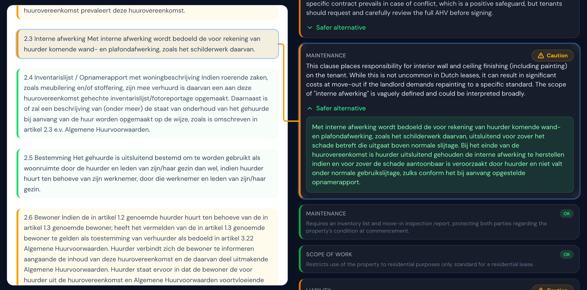
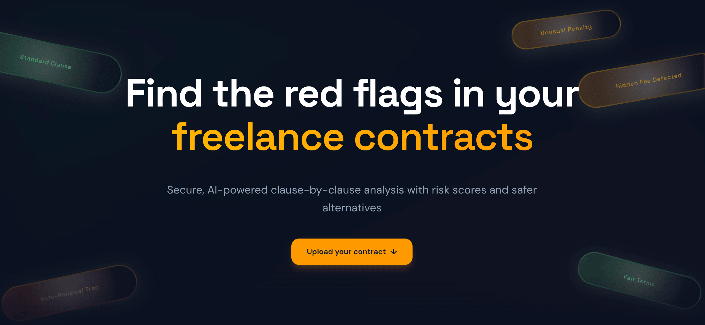

<p align="center">
  
</p>

<p align="center">
  <a href="https://github.com/luclacombe/red-flag-ai/actions/workflows/ci.yml"></a>
  
  
  <a href="https://red-flag-ai.com"></a>
  
</p>

<p align="center">
  <b><a href="https://red-flag-ai.com">Live Demo</a></b> &middot;
  <a href="#features">Features</a> &middot;
  <a href="#architecture">Architecture</a> &middot;
  <a href="#engineering-highlights">Engineering</a> &middot;
  <a href="#local-setup">Setup</a>
</p>

---

## Features

- **Multi-format upload** — PDF, DOCX, and TXT contracts
- **AI relevance gate** — rejects non-contracts before wasting compute
- **RAG-grounded analysis** — 150 curated predatory patterns matched via Voyage AI legal embeddings + pgvector
- **Real-time streaming** — clause results stream to the UI as they're analyzed, not after
- **Side-by-side view** — original document with interactive clause highlighting and connecting lines
- **15-language support** — analysis in the user's chosen language; safer alternatives stay in the document's language
- **Shareable reports** — expiring share links + downloadable PDF reports
- **Privacy-first** — AES-256-GCM encryption at rest, 30-day auto-deletion, GDPR-compliant IP hashing

<p align="center">
  
</p>

## How It Works

1. Upload a contract (PDF, DOCX, or TXT)
2. AI checks if it's actually a contract — rejects non-contracts immediately
3. Clauses are extracted via hybrid parsing (regex heuristic + LLM fallback)
4. Each clause is analyzed against a RAG knowledge base of 150 predatory patterns
5. Results stream clause by clause: risk score, explanation, and safer alternative
6. Summary with overall risk score, top concerns, and a sign/don't-sign recommendation

<p align="center">
  
</p>

## Architecture


### Pipeline

| Step | Agent | Model | Purpose |
|------|-------|-------|---------|
| 1 | Relevance Gate | Haiku | Classify: is this a contract? What type? What language? |
| 2 | Smart Parse | Heuristic + Haiku fallback | Split document into individual clauses |
| 3 | Combined Analysis | Sonnet (streaming) | Score each clause, generate safer alternatives, produce summary |

Total: 3–4 API calls per analysis (gate + optional boundary detection + combined analysis + optional summary fallback).

### Knowledge Base (RAG)

150 curated predatory contract patterns covering leases, NDAs, employment contracts, freelance agreements, and terms of service. Each pattern includes a risk description, category, and safer alternative.

Patterns are embedded with [Voyage AI](https://www.voyageai.com/)'s `voyage-law-2` model (legal-domain-specific, 1024 dimensions) and stored via pgvector. At analysis time, all patterns for the detected contract type are bulk-fetched and injected into the system prompt — Claude has domain-specific knowledge about what to flag.

Seed data ships with pre-computed embeddings. No Voyage API key needed for local development.

## Engineering Highlights

- **Multi-agent AI pipeline** — Three specialized agents (gate → parse → analysis), each a pure async function with Zod-validated inputs and outputs. No classes, no shared mutable state.
- **Hybrid clause parsing** — Regex heuristic runs first (instant, free). Falls back to Haiku LLM anchor-based boundary detection when the heuristic produces suspicious results (e.g., 1 clause from a 10-page document). Graceful degradation: if both fail, heuristic result used as-is.
- **Structured outputs with zero parse errors** — Claude `strict: true` mode (constrained decoding) guarantees valid JSON tool calls. Zero JSON parse failures in production.
- **Pipeline resilience** — Atomic `UPDATE ... WHERE status = 'pending' RETURNING *` prevents duplicate runs from concurrent SSE reconnects. Parse results are cached. Clause analyses are persisted individually as they stream. On Vercel timeout + reconnect, the pipeline skips completed work and resumes from the last checkpoint.
- **Streaming architecture** — tRPC SSE subscriptions with typed event streams. First event within 25 seconds (Vercel constraint). Heartbeat-based keepalive prevents timeouts at the 300-second limit.
- **Application-level encryption** — AES-256-GCM with HKDF-SHA256 per-document key derivation from a master key. Separate key contexts for documents vs. clauses. HMAC-SHA256 IP hashing for rate limits (irreversible, GDPR-compliant).
- **Monorepo with strict dependency boundaries** — Turborepo with unidirectional deps: `web → api → agents → db → shared`. Internal packages export TypeScript source directly — no per-package build step.
- **Zero-config local dev** — Single `pnpm run setup` bootstraps Supabase (Postgres + pgvector + Auth + Storage), seeds 150 knowledge patterns with pre-computed embeddings, and outputs the next steps.

## Tech Stack

| Layer | Technology |
|-------|-----------|
| Frontend | Next.js 16, React 19, TypeScript strict, Tailwind CSS v4, shadcn/ui |
| API | tRPC v11 — end-to-end type safety, SSE subscriptions |
| AI | Claude API (Anthropic SDK), multi-agent pipeline |
| Knowledge Base | 150 curated legal patterns, Voyage AI embeddings (`voyage-law-2`, 1024 dims), pgvector |
| Database | Supabase — PostgreSQL + pgvector + Auth + Storage |
| ORM | Drizzle |
| Validation | Zod v4 at all boundaries |
| Deployment | Vercel (Node.js runtime, 300s function timeout) |
| CI/CD | GitHub Actions — lint → type-check → test → build |
| Linting | Biome |

## Project Structure

```
apps/web/              → Next.js App Router (UI + route handlers)
packages/api/          → tRPC v11 routers, procedures, context
packages/agents/       → Agent pipeline (gate, smart parse, combined analysis, summary)
packages/db/           → Drizzle schema, migrations, vector search, embeddings
packages/shared/       → Zod schemas, types, constants, logger
```

Dependency direction: `web → api → agents → db → shared` (shared is the leaf).

## Local Setup

### Prerequisites

- [Node.js](https://nodejs.org/) 22+
- [pnpm](https://pnpm.io/) 10+
- [Docker Desktop](https://www.docker.com/products/docker-desktop/) (for local Supabase)
- [Supabase CLI](https://supabase.com/docs/guides/cli/getting-started) 2.x
- An [Anthropic API key](https://console.anthropic.com/)

### Quick Start

```bash
# 1. Clone and install
git clone https://github.com/luclacombe/red-flag-ai.git
cd red-flag-ai
pnpm install

# 2. Start local Supabase (Postgres + pgvector, Auth, Storage, Studio)
pnpm supabase:start

# 3. Reset database (applies migrations + seeds knowledge base with pre-computed embeddings)
pnpm supabase:reset

# 4. Configure environment
cp .env.example .env.local
# Edit .env.local — add your ANTHROPIC_API_KEY

# 5. Start dev server
pnpm dev
```

Open [localhost:3000](http://localhost:3000). Supabase Studio at [127.0.0.1:54323](http://127.0.0.1:54323).

## Security

- **AES-256-GCM encryption at rest** — all document content and PII encrypted with per-document derived keys (HKDF-SHA256)
- **30-day auto-deletion** — documents and analysis data purged automatically via cron
- **HMAC-SHA256 IP hashing** — rate limit identifiers are irreversibly hashed (GDPR-compliant)
- **Row Level Security** — Supabase RLS enforced on all tables
- **Private by default** — analyses require explicit share toggle; share links expire after 7 days
- **HTTP security headers** — CSP, HSTS, X-Frame-Options, Permissions-Policy
- **Prompt injection defense** — document text treated as untrusted input in all AI agent prompts

See [SECURITY.md](SECURITY.md) for the responsible disclosure policy.

## What I'd Improve With More Time

- **Jurisdiction-specific patterns.** The knowledge base is jurisdiction-agnostic. Add region-specific pattern sets (EU, US states, UK).
- **LLM observability.** Add tracing (e.g., Langfuse) for token usage, latency per agent, and prompt versioning.
- **Contract comparison.** Upload two versions of a contract, diff the clauses.
- **PDF viewer.** Render the original PDF in the side-by-side view instead of extracted text.

## Cost

Each analysis costs ~**$0.01–$0.05** in Claude API calls depending on document length. Voyage AI is only used for seeding the knowledge base (one-time cost), not per-analysis. Rate limiting controls spend: 1 analysis/day for anonymous users, 3/day for authenticated users.

## License

[MIT](LICENSE)

---

*RedFlag AI is not a substitute for professional legal advice. It provides AI-generated analysis for informational purposes only. Always consult a qualified attorney before making legal decisions based on contract review.*
