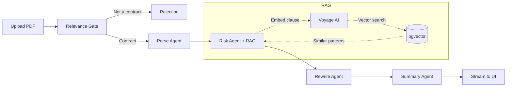

# RedFlag AI

AI-powered contract red-flag detector. Upload a PDF, get clause-by-clause risk analysis with streaming results.

[](https://github.com/luclacombe/red-flag-ai/actions/workflows/ci.yml)

**Live:** [red-flag-ai.com](https://red-flag-ai.com)

---

## How It Works

1. Upload a contract (PDF)
2. AI checks if it's actually a contract — rejects non-contracts immediately
3. Clauses are extracted and analyzed against a curated knowledge base of predatory patterns (RAG)
4. Results stream to the UI in real-time — each clause scored red/yellow/green with explanations
5. Get a summary with an overall risk score, top concerns, and a sign/don't-sign recommendation

## Architecture



### Pipeline

| Step | Agent | Model | Purpose |
|------|-------|-------|---------|
| 1 | Relevance Gate | Claude Haiku | Is this a contract? What type? What language? |
| 2 | Parse Agent | Claude Sonnet | Split into individual clauses |
| 3 | Risk Agent | Claude Sonnet | Score each clause (red/yellow/green) with RAG context |
| 4 | Rewrite Agent | Claude Sonnet | Generate safer alternative for flagged clauses |
| 5 | Summary Agent | Claude Sonnet | Overall risk score + recommendation |

## Tech Stack

| Layer | Technology |
|-------|-----------|
| Frontend | Next.js 16, React 19, TypeScript strict, Tailwind CSS v4, shadcn/ui |
| API | tRPC v11 (end-to-end type safety, SSE subscriptions) |
| AI | Claude API (Anthropic SDK), multi-agent pipeline |
| Embeddings | Voyage AI (voyage-law-2, 1024 dims) |
| Database | Supabase (PostgreSQL + pgvector + Storage) |
| ORM | Drizzle |
| Validation | Zod v4 at all boundaries |
| Deployment | Vercel (Node.js runtime, 300s timeout) |
| CI/CD | GitHub Actions (lint → type-check → test → build) |
| Linting | Biome |

## Project Structure

```
apps/web/              → Next.js App Router (UI + route handlers)
packages/api/          → tRPC v11 routers, procedures, context
packages/agents/       → Agent pipeline (gate, parse, risk, rewrite, summary)
packages/db/           → Drizzle schema, migrations, vector search, embeddings
packages/shared/       → Zod schemas, types, constants, logger
```

Dependency direction: `web → api → agents → db → shared` (shared is the leaf).

## Local Setup

```bash
# Clone
git clone https://github.com/luclacombe/red-flag-ai.git
cd red-flag-ai

# Install
pnpm install

# Environment variables
cp .env.example .env.local
# Fill in:
#   NEXT_PUBLIC_SUPABASE_URL
#   SUPABASE_SERVICE_ROLE_KEY
#   ANTHROPIC_API_KEY
#   VOYAGE_API_KEY
#   NEXT_PUBLIC_APP_URL=http://localhost:3000

# Seed the knowledge base
pnpm run seed

# Start dev server
pnpm dev
```

## What I'd Improve With More Time

- **Authentication** — Supabase Auth is wired but login flows are deferred. Unlock higher rate limits for logged-in users.
- **Side-by-side view** — Clause positions (`startIndex`/`endIndex`) are already stored. Build a split view: original PDF on the left, annotations on the right.
- **DOCX support** — Many contracts arrive as Word docs. Add extraction with `mammoth` or similar.
- **Jurisdiction-specific patterns** — The knowledge base is jurisdiction-agnostic. Add region-specific pattern sets (EU, US states, UK).
- **LLM observability** — Add tracing (e.g., Langfuse) for token usage, latency per agent, and prompt versioning.
- **Contract comparison** — Upload two versions of a contract, diff the clauses.
- **Shareable analysis URLs** — Currently anonymous. Add shareable links for completed analyses.

## Cost Note

Each full analysis costs approximately **$0.10–0.20** in API calls (Claude + Voyage AI), depending on document length. IP-based rate limiting (2 analyses/day for anonymous users) controls spend.

## Legal Disclaimer

RedFlag AI is **not a substitute for professional legal advice**. It provides AI-generated analysis for informational purposes only. Always consult a qualified attorney before making legal decisions based on contract review. The developers are not responsible for any actions taken based on this tool's output.
